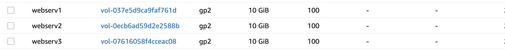
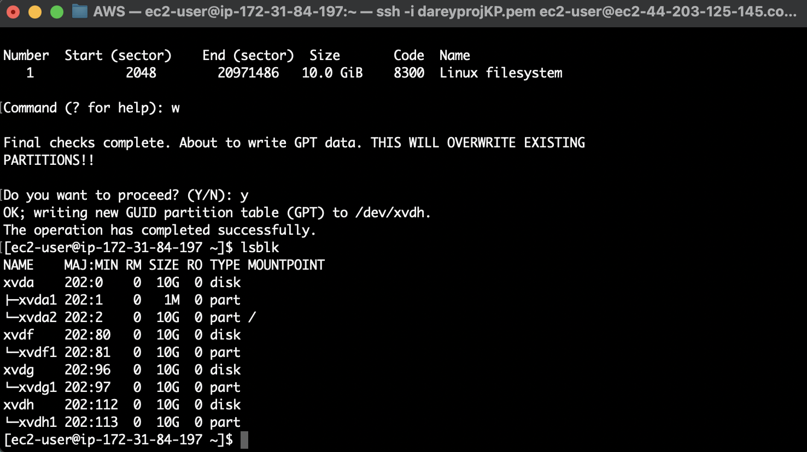
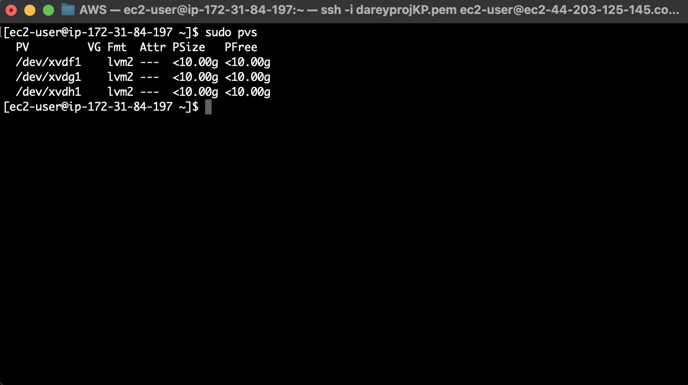
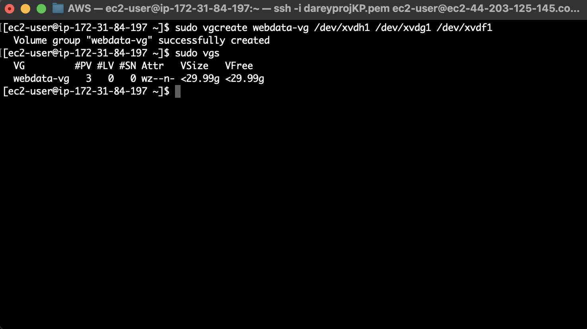
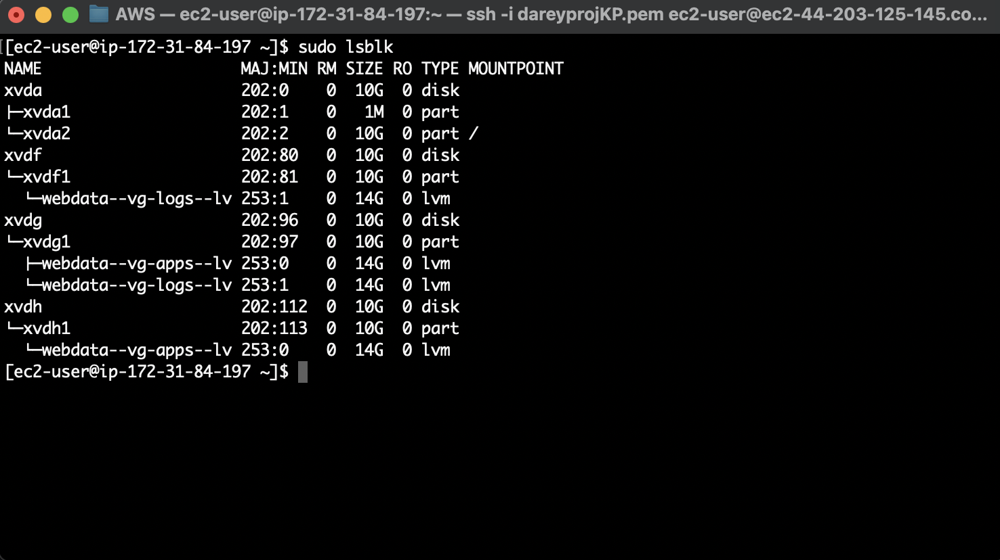
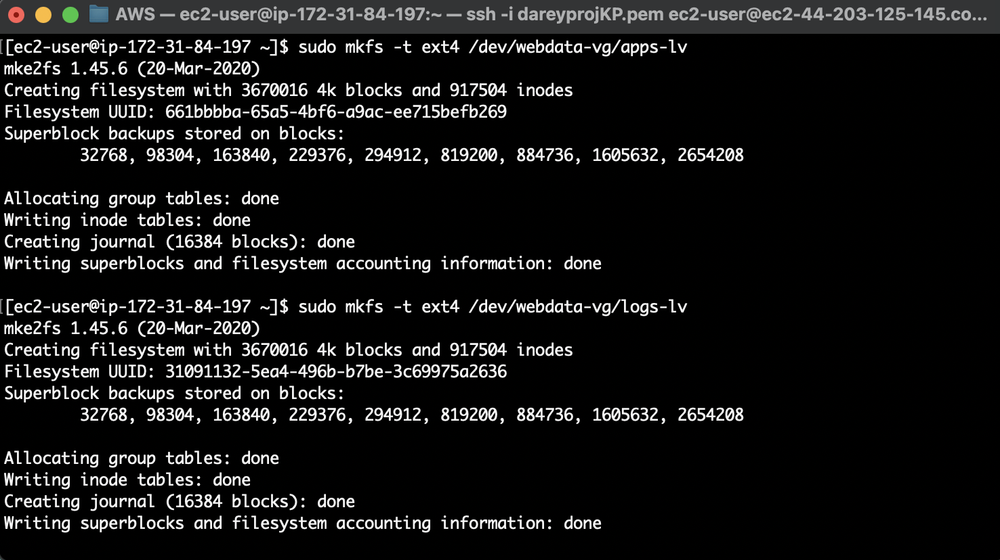
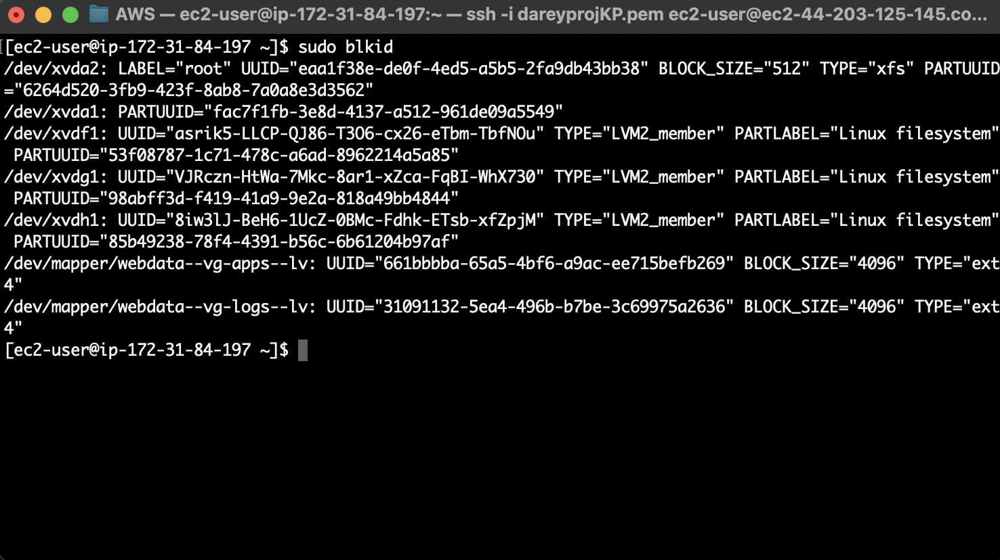
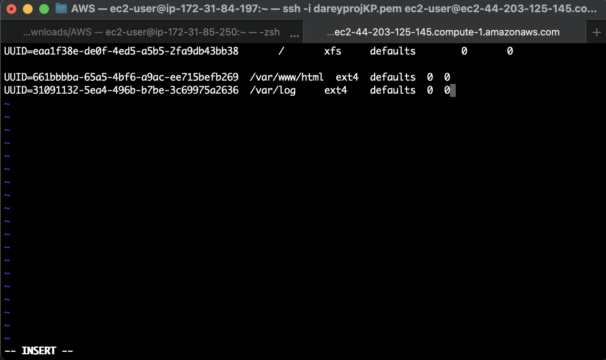
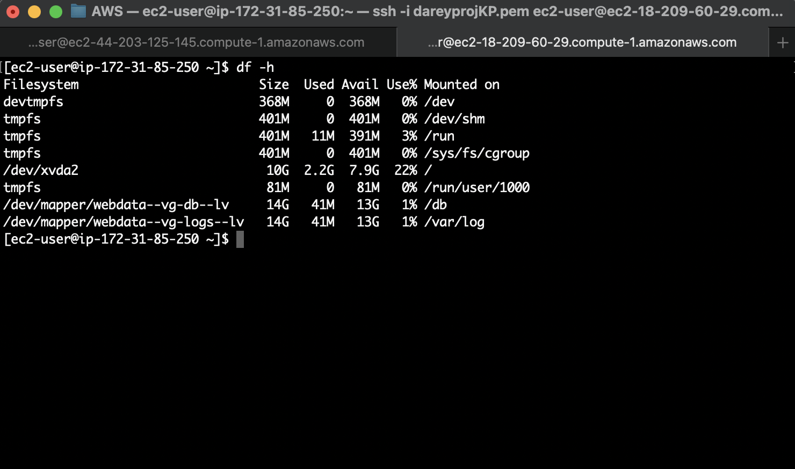

# A Three-Tier Web Solution with WordPress

Generally, web or mobile solutions are implemented based on what is called the Three-tier Architecture.

Three-tier Architecture is a client-server software architecture pattern that comprise of 3 separate layers.

The two parts of this project comprise of:
- Creating a Linux-based sub storage system for the web and database layers.
- Installing WordPress and connecting it to a remote MySQL database server.

## Step 1: Launch a web server and build storage volumes

Launch an EC2 Instance of RedHat Linux configuration and name it as web-server.

Create three 10 GiB EBS volumes in the same AZ and attach them to the EC2 instance which will be the web server.

Attach the three volumes to the EC2 instance



Connect to the instance and inspect the volumes attached to it with the `lsblk` command:

```
lsblk
```

To see all mounts and free space on the server:

```
df -h
```

Use gdisk utility to create a single partition on each of the 3 disks:

```
sudo gdisk /dev/xvdf
sudo gdisk /dev/xvdg
sudo gdisk /dev/xvdh
```



Install lvm2 package:

```
sudo apt install lvm2
```

Check for available partitions:

```
sudo lvmdiskscan 
```

Use the pvcreate utility to mark each of 3 disks as physical volumes:

Use the `pvcreate` utility to mark each of 3 disks as physical volumes:

```
sudo pvcreate /dev/xvdf1
sudo pvcreate /dev/xvdg1
sudo pvcreate /dev/xvdh1
```

To confirm use:

```
sudo pvs
```




With the `vgcreate` command, create a volume group of the three physical volumes and name it `webdata-vg`:

```
sudo vgcreate webdata-vg /dev/xvdh1 /dev/xvdg1 /dev/xvdf1
```

Verify that the VG has been created successfully by running:

```
sudo vgs
```



With `lvcreate` command, create two separate logical volumes, app-lv (to store website data) and logs-lv (to store logs data) and verify the configuration:

```
sudo lvcreate -n apps-lv -L 14G webdata-vg
sudo lvcreate -n logs-lv -L 14G webdata-vg
sudo lvs
```

To confirm the whole set up use:

```
sudo vgdisplay -v
sudo lsblk
```



Format the logical volumes with ext4 filesystem:

```
sudo mkfs -t ext4 /dev/webdata-vg/apps-lv
sudo mkfs -t ext4 /dev/webdata-vg/logs-lv
```




Create two separate directories to store website files and log data:


```
sudo mkdir -p /var/www/html
sudo mkdir -p /home/recovery/logs
```


Mount the /var/www/html on apps-lv logical volume:

```
sudo mount /dev/webdata-vg/apps-lv /var/www/html/
```

With `rsync` command, backup all the files in the log directory /var/log into /home/recovery/logs:


```
sudo rsync -av /var/log/. /home/recovery/logs/
```

Now, mount the /var/logs file onto the data-vg logical volume:

```
sudo mount /dev/webdata-vg/logs-lv /var/log
```

Restore the data on the /var/logs file as all the existing data is deleted:

```
sudo rsync -av /home/recovery/logs/. /var/log
```

## UPDATE THE /ETC/FSTAB FILE

To make the mount configuration persist, make additions to the `/etc/fstab` file as seen below with the UUIDs.

Use the below command to retrieve the UUIDs and then update the fstab file rememebering to remove the leading and ending quotes:

```
sudo blkid
```



Update `/etc/fstab`:





To test the configuration and reload the daemon:

```
sudo mount -a
```

```
sudo systemctl daemon-reload
```

To view and check the final setup, use:

```
df -h
```



## CREATE DB SERVER

- Launch a second RedHat EC2 instance that will be the ‘DB Server’.

- Repeat the same steps as the Web Server, but instead of apps-lv, create db-lv and mount it to /db directory instead of /var/www/html/.

## Install WordPress on Web Server 

Update the repository, then install wget, Apache and dependencies:

```
sudo yum -y update

sudo yum -y install wget httpd php php-mysqlnd php-fpm php-json
```

Start Apache and also install PHP with its dependencies:

```
sudo systemctl enable httpd
sudo systemctl start httpd
sudo yum install https://dl.fedoraproject.org/pub/epel/epel-release-latest-8.noarch.rpm
sudo yum install yum-utils http://rpms.remirepo.net/enterprise/remi-release-8.rpm
sudo yum module list php
sudo yum module reset php
sudo yum module enable php:remi-7.4
sudo yum install php php-opcache php-gd php-curl php-mysqlnd
sudo systemctl start php-fpm
sudo systemctl enable php-fpm
sudo setsebool -P httpd_execmem 1
```

Restart Apache:

```
sudo systemctl restart httpd
```

Install WordPress and copy it to /var/www/html:

```
mkdir wordpress
cd   wordpress
sudo wget http://wordpress.org/latest.tar.gz
sudo tar xzvf latest.tar.gz
sudo rm -rf latest.tar.gz
sudo cp wordpress/wp-config-sample.php wordpress/wp-config.php
sudo cp -R wordpress /var/www/html/
```

Configure Selinux:

```
sudo chown -R apache:apache /var/www/html/wordpress
sudo chcon -t httpd_sys_rw_content_t /var/www/html/wordpress -R
sudo setsebool -P httpd_can_network_connect=1
```


